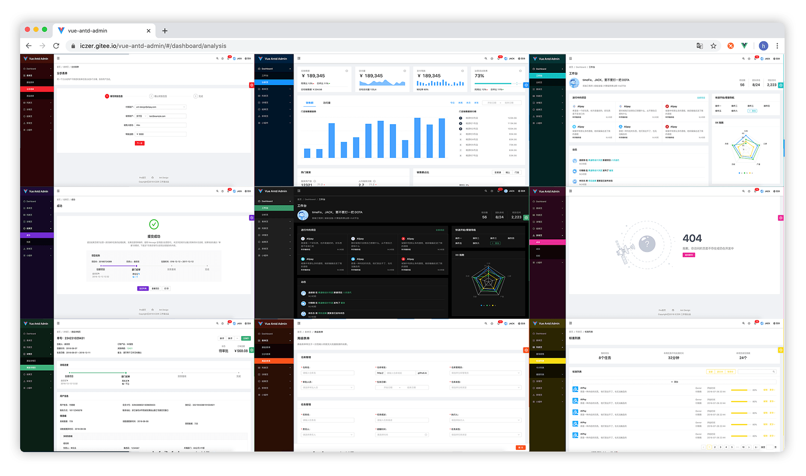

简体中文 | [English](./README.en-US.md)
<h1 align="center">Vue Antd Admin</h1>

<div align="center">
  
[Ant Design Pro](https://github.com/ant-design/ant-design-pro) 的 Vue 实现版本  
开箱即用的中后台前端/设计解决方案

:star::star::star:
vue3 版本现已推出，更名为
[stepin-template](https://github.com/stepui/stepin-template)，欢迎体验，
[立即前往](https://github.com/stepui/stepin-template)
--

[](https://github.com/iczer/vue-antd-admin/blob/master/LICENSE)
[](https://david-dm.org/iczer/vue-antd-admin)
[](https://david-dm.org/iczer/vue-antd-admin?type=dev)
[](https://github.com/iczer/vue-antd-admin/releases/latest)
  

多种主题模式可选：  

</div>

- 预览地址：https://iczer.gitee.io/vue-antd-admin
- 使用文档：https://iczer.gitee.io/vue-antd-admin-docs
- 常见问题：https://iczer.gitee.io/vue-antd-admin-docs/start/faq.html
- 国内镜像：https://gitee.com/iczer/vue-antd-admin

## 浏览器支持
现代浏览器及 IE10

| [](http://godban.github.io/browsers-support-badges/)</br>IE / Edge | [](http://godban.github.io/browsers-support-badges/)</br>Firefox | [](http://godban.github.io/browsers-support-badges/)</br>Chrome | [](http://godban.github.io/browsers-support-badges/)</br>Safari | [](http://godban.github.io/browsers-support-badges/)</br>Opera |
| --- | --- | --- | --- | --- |
| IE10, Edge | last 2 versions | last 2 versions | last 2 versions | last 2 versions |

## 使用
### clone
```bash
$ git clone https://github.com/iczer/vue-antd-admin.git
```
### yarn
```bash
$ yarn install
$ yarn serve
```
### or npm
```
$ npm install
$ npm run serve
```
更多信息参考 [使用文档](https://iczer.gitee.io/vue-antd-admin-docs)

## 参与贡献
我们非常欢迎你的贡献，你可以通过以下方式和我们一起共建 :star2:：
- 在你的公司或个人项目中使用 Vue Antd Admin。
- 通过 [Issue](https://github.com/iczer/vue-antd-admin/issues) 报告:bug:或进行咨询。
- 提交 [Pull Request](https://github.com/iczer/vue-antd-admin/pulls) 改进 Admin 的代码。
- 加入社群，与小伙伴们一同交流心得。QQ群：942083829、 812277510（已满）、610090280（已满）

## 打赏
如果该项目对您有所帮助，可以请作者喝一杯咖啡。
<p>
  
  
</p>
