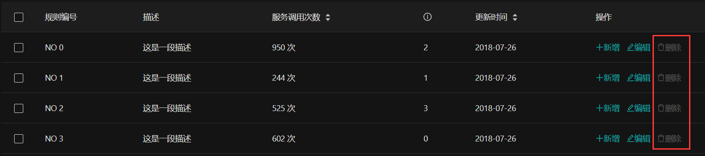

# 权限管理
权限控制是中后台系统中常见的需求之一，你可以利用 Vue Antd Admin 提供的权限控制脚手架，实现一些基本的权限控制功能。
## 角色和权限
通常情况下有两种方式可以控制用户权限，一种是通过用户角色 role 来控制权限，另一种是通过更细致的权限 permission 来控制。
这两种方式 Vue Antd Admin 都支持。  
我们定义了 role 和 permission 的基本格式，如果你获取的 role 和 permission 数据格式与 Vue Antd Admin 不一致，
你需要在获取到 role 和 permission 后将其转换为 Vue Antd Admin 的格式。
### 角色
Vue Antd Admin 的 `角色/role` 包含 `id` 和 `operation` 两个属性。其中 `id` 为 `角色/role` 的 id，`operation` 为 `角色/role` 具有的操作权限，是一个字符串数组。
```js
role = {
  id: 'admin',                                   //角色ID
  operation: ['add', 'delete', 'edit', 'close']  //角色的操作权限
}
```
你也可以设置 role 的值为字符串，比如 role = 'admin', 它等同于：
```js
role = {
  id: 'admin'
}
```
### 权限
Vue Antd Admin 的 `权限/permission` 也包含 `id` 和 `operation` 两个属性。其中 `id` 为 `权限/permission` 的 id，`operation` 为 `权限/permission` 下的操作权限，是一个字符串数组。
```js
permission = {
  id: 'form',                                    //权限ID
  operation: ['add', 'delete', 'edit', 'close']  //权限下的操作权限
}
```
你也可以设置 role 的值为字符串，比如 permission = 'form', 它等同于：
```js
permission = {
  id: 'form'
}
```
### 设置用户的角色和权限
你只需为用户配置 roles 和 permissions 两者中的其中一种，即可完成权限管理功能。当然你也可以两者都配置。 
 
获取到用户权限或角色后，将其格式化转为 Vue Antd Admin 可用的格式，然后使用 `store.commit('account/setPermissions', permissions)` 或 `store.commit('account/setRoles', roles)`
将其存在本地即可。如下：
```js
getPermissions().then(res => {
  const permissions = res.data
  this.$store.commit('account/setPermissions', permissions)
})
getRoles().then(res => {
  const roles = res.data
  this.$store.commit('account/setRoles', roles)
})
```
:::tip
注意，存在本地的 permissions 和 roles 都应该是数组。  
你可以在 /pages/login/Login.vue 查看完整的用户角色和权限设置代码。
:::
## 页面权限
如果你想给一些页面设置准入权限，只需要给该页面对应的路由设置元数据 authority 即可。 authority 的值可以是一个字符串，也可以是对象。  

如下路由配置，则表明 `验权页面` 需要准入权限(permission): `form`
```js {5}
const route = {
  name: '验权页面',
  path: 'auth/demo',
  meta: {
    authority: 'form',
  },
  component: () => import('@/pages/demo')
}
```
下面是 authority 的值为对象的写法，这种写法和上面字符串的写法具有相同的效果：
```js {5-7}
const route = {
  name: '验权页面',
  path: 'auth/demo',
  meta: {
    authority: {
      permission: 'form'
    }
  },
  component: () => import('@/pages/demo')
}
```
有时你可能需要通过用户角色来配置页面权限，我们同样支持，用法和上面类似。  

如下配置，表明 `验权页面` 需要准入角色(role) `admin`：
```js {5-7}
const route = {
  name: '验权页面',
  path: 'auth/demo',
  meta: {
    authority: {
      role: 'admin'
    }
  },
  component: () => import('@/pages/demo')
}
```
:::tip
当你未设置 authority 或 设置 authority 的值 为 `*` 时，等同于该页面无需权限限制，我们会忽略此页面的权限检查。
:::
:::tip
当 authority 的值为字符串时，会以 [权限/permission](#权限) 验证权限。如果你需要以 [角色/role](#角色) 验证权限，请以对象形式设置 authority 的值。
:::
## 操作权限
在一些复杂的些场景下，权限可能不仅仅是页面层级这么简单。在一些页面你可能需要校验用户是否具有某些操作的权限，比如 增、删、改、查等。  
为此，我们提供了 `权限校验注入` 和 `权限校验指令` 两个实用的功能。
### 权限校验注入
通过对Vue组件的实例方法进行 `权限校验注入`，我们可以控制该实例方法的执行权限，从而精准且安全的验证用户操作。  

比如，QueryList 页面的 deleteRecord 方法，我们希望具有操作权限 `delete` 的用户才能调用此方法。
只需为 `deleteRecord` 方法注入权限校验，按如下方式配置 `authorize` 即可：
```vue {9-11,13}
<template>
  ...
</template>
<script>
...
export default {
  name: 'QueryList',
  data () {...},
  authorize: {              //权限校验注入设置
    deleteRecord: 'delete'  //key为需要注入权限校验的方法名，这里为 deleteRecord 方法；值为需要校验的操作权限，这里为 delete 操作权限
  },
  methods: {
    deleteRecord(key) {
      this.dataSource = this.dataSource.filter(item => item.key !== key)
      this.selectedRows = this.selectedRows.filter(item => item.key !== key)
    },
    ...
  }
}
</script>
```
如果用户没有 `delete` 权限，调用 deleteRecord 方法，会看到如下提示：  


### 操作权限校验的类型
`authorize` 会根据当前页面匹配到的权限类型([permission](#权限) / [role](#角色))，来判断是使用 `permission.operation` 还是 `role.operation` 来进行权限校验。
如果当前页面同时匹配到了 permission 和 role 权限，则默认通过 permission.operation 来进行操作权限校验。  

当然你也可以指定操作权限校验的类型，如下设置即可：
```js {2-5}
authorize: {             
  deleteRecord: {        //需要 注入权限校验 的方法名：deleteRecord
    check: 'delete',     //需要校验的操作权限：check
    type: 'role'         //指定操作权限校验的类型，可选 permission 和 role。这里指定以 role.operation 校验操作权限
  }
}
```
### 权限校验指令
有时我们可能希望用户能够更直观的了解自己的操作权限。比如给没有操作权限的控件应用 disable 样式，禁用 click 事件等。
我们提供了权限校验指令 `v-auth` 来实现这个功能。  

比如，我们想为 QueryList 页面的删除控件进行 `delete` 操作权限校验，只需为删除控件设置 v-auth="\`delete\`" 指令即可，如下：
```vue {6}
<template>
  <a-card>...
    <standard-table ...>
      ...
      <div slot="action" slot-scope="{text, record}">
        <a @click="deleteRecord(record.key)" v-auth="`delete`">
          <a-icon type="delete" />删除
        </a>
      </div>
      ...
    </standard-table>
  </a-card>
</template>
```
假如用户没有 `delete` 操作权限，则控件会被应用 disable 样式，且 click 事件无效，如下图：  


:::warning 重要！！！
v-auth 是我们自定义的一个 [Vue指令](https://cn.vuejs.org/v2/guide/custom-directive.html#ad)。因为 `Vue指令` 的值需要是一个 javascript 表达式，因此你不能直接给 v-auth 赋值为字符串，
需要把 v-auth 的字符串值用 ` `` ` 包裹起来，否则可能会报 undefined 错误。
:::
### 权限校验指令的类型
你同样也可以指定 v-auth 的权限校验类型，可选 [permission](#权限) 和 [role](#角色)。它的校验方式和 [authorize](#权限校验注入) 类似，如未指定则会自动识别。
`v-auth:role` 表示通过 `role.operation` 进行校验，`v-auth:permission` 表示通过 `permission.operation` 进行校验。 
 
如下，指定通过 `role.operation` 校验删除控件的操作权限：
```vue {3}
<div slot="action" slot-scope="{text, record}">
  ...
  <a v-auth:role="`delete`">
    <a-icon type="delete" />删除
  </a>
  ...
</div>
```
## 异步路由权限
异步路由同样可以进行权限校验配置，它和正常的路由权限配置基本无异，只是无需把 [authority](#页面权限) 配置在元数据属性 meta 里。
你可以在路由组件注册时设置 authority，也可以在异步路由配置里设置 authority。  

路由组件注册时设置 [authority](#页面权限)：
```js {6}
// 路由组件注册
const routerMap = {
  ...
  demo: {
    name: '演示页',
    authority: 'form',
    component: () => import('@/pages/demo')
  }
  ...
}
```

异步路由配置里设置 [authority](#页面权限)：
```js {11-13}
const routesConfig = [{
    router: 'root',
    children: ['demo',
      {router: 'parent1'...},
      ...
      {
        router: 'demo',
        icon: 'file-ppt',
        path: 'auth/demo',
        name: '验权页面',
        authority: {
          permission: 'form',
        }
      }
    ]
  }]
```
