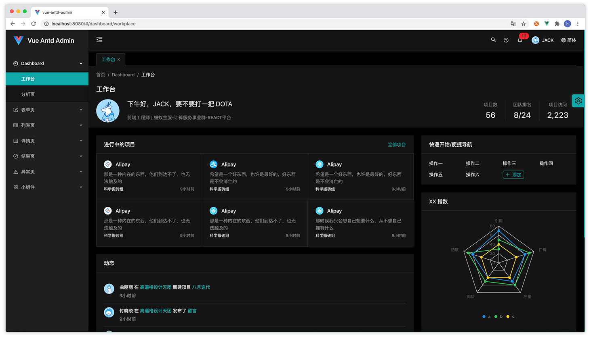

# 主题定制

## 主题颜色
### 主题色
我们内置了一个色盘供您选择 

<color color="#fa541c"/>
<color color="#fadb14"/>
<color color="#3eaf7c"/>
<color color="#13c2c2"/>
<color color="#1890ff"/>
<color color="#722ed1"/>
<color color="#eb2f96"/>

如果这不能满足你的需求，你也可以使用任何你喜欢的颜色，只需要在 src/config/config.js 文件中配置你的主题色即可。如：
```js {3}
module.exports = {
  theme: {
    color: '#13c2c2', //换成任何你喜欢的颜色，支持 hex 色值
    mode: 'night'
  },
  multiPage: true,
  animate: {
    name: 'roll',
    direction: 'default'
  }
}
```
当你设置好主题色后，系统会根据这个主题色为你生成一系列配套的颜色，并应用到vue组件中。
:::tip 
你可以在你的样式文件中直接使用 less 变量 ``@theme-color``。
::: 
:::warning
主题色目前只支持 ``hex`` 模式的色值。如果设置为 ``rgb`` 或其它模式的色值，可能会导致配套颜色无法生成。
:::
### 功能色
除了主题色，系统还有一些功能性颜色，分别为：成功色、警告色和错误色。默认色值分别为：
|名称|success   |warning  |error  |
|:-:|:--------:|:-------:|:-----:|
|色值|``#52c41a``|``#faad14``|``#f5222d``|
|颜色|<color color="#52c41a"/>|<color color="#faad14"/>|<color color="#f5222d" />|
|less变量|@success-color|@warning-color|@error-color|

你也可以在 src/config/config.js 重新定义这些功能色
```js {5-7}
module.exports = {
  theme: {
    color: '#13c2c2', 
    mode: 'night',
    success: '#52c41a', //定义成功色，支持 hex 色值
    warning: '#faad14', //定义警告色，支持 hex 色值
    error: '#f5222d'    //定义错误色，支持 hex 色值
  },
  multiPage: true,
  animate: {
    name: 'roll',
    direction: 'default'
  }
}
```
:::tip
想在在你的样式文件中使用以上各功能色，引用各功能色对应的 less 变量即可。
:::
:::warning
功能色目前也只支持 ``hex`` 模式的色值。如果设置为 ``rgb`` 或其它模式的色值，可能会导致配套颜色无法生成。
:::
### 文本色
<table style="text-align: center" >
  <tr>
    <th>主题模式</th>
    <th>标题色</th>
    <th>文本色</th>
    <th>次级文本色</th>
  </tr>
  <tr>
    <td rowspan="2">light/dark</td>
    <td><color color="rgba(0,0,0,0.85)"/></td>
    <td><color color="rgba(0,0,0,0.65)"/></td>
    <td><color color="rgba(0,0,0,0.45)"/></td>
  </tr>
  <tr>
    <td><code>rgba(0,0,0,0.85)</code></td>
    <td><code>rgba(0,0,0,0.65)</code></td>
    <td><code>rgba(0,0,0,0.45)</code></td>
  </tr>
  <tr>
    <td rowspan="2">night</td>
    <td><color color="rgba(255,255,255,0.85)"/></td>
    <td><color color="rgba(255,255,255,0.65)"/></td>
    <td><color color="rgba(255,255,255,0.45)"/></td>
  </tr>
  <tr>
    <td><code>rgba(255,255,255,0.85)</code></td>
    <td><code>rgba(255,255,255,0.65)</code></td>
    <td><code>rgba(255,255,255,0.45)</code></td>
  </tr>
  <tr>
    <td>less变量</td>
    <td>@title-color</td>
    <td>@text-color</td>
    <td>@text-color-second</td>
  </tr>
</table>

:::tip
想在在你的样式文件中使用以上文本色，引用各文本色对应的 less 变量即可。
:::
:::warning
目前不支持自定义文本色，因为涉及到主题模式切换时文本色的置换问题。如强行修改，可能会导致主题模式切换时出现样式异常。
如果你的项目不需要主题模式切换，可自行替换以上文本色。
:::

### 背景色

<table style="text-align: center">
  <tr>
    <th>主题模式</th>
    <th>布局背景色</th>
    <th>基础背景色</th>
    <th>hover背景色</th>
    <th>边框颜色</th>
    <th>阴影颜色</th>
  </tr>
  <tr>
    <td rowspan="2">light/dark</td>
    <td><color color="#f0f2f5"/></td>
    <td><color color="#fff"/></td>
    <td><color color="rgba(0,0,0,0.025)"/></td>
    <td><color color="#f0f0f0"/></td>
    <td><color color="rgba(0,0,0,0.15)"/></td>
  </tr>
  <tr>
    <td><code>#f0f2f5</code></td>
    <td><code>#fff</code></td>
    <td><code>rgba(0,0,0,0.025)</code></td>
    <td><code>#f0f0f0</code></td>
    <td><code>rgba(0,0,0,0.15)</code></td>
  </tr>
  <tr>
    <td rowspan="2">night</td>
    <td><color color="#000"/></td>
    <td><color color="#141414"/></td>
    <td><color color="rgba(255,255,255,0.025)"/></td>
    <td><color color="#303030"/></td>
    <td><color color="rgba(255,255,255,0.15)"/></td>
  </tr>
  <tr>
    <td><code>#000</code></td>
    <td><code>#141414</code></td>
    <td><code>rgba(255,255,255,0.025)</code></td>
    <td><code>#303030</code></td>
    <td><code>rgba(255,255,255,0.15)</code></td>
  </tr>
  <tr>
    <td>less变量</td>
    <td>@layout-bg-color</td>
    <td>@base-bg-color</td>
    <td>@hover-bg-color</td>
    <td>@border-color</td>
    <td>@shadow-color</td>
  </tr>
</table>

:::tip
想在在你的样式文件中使用以上背景色，引用各背景色对应的 less 变量即可。
:::
:::warning
目前也不支持自定义背景色，因为涉及到主题模式切换时背景色的置换问题。如强行修改，可能会导致主题模式切换时出现样式异常。
如果你的项目不需要主题模式切换，可自行替换以上背景色。
:::

### antd 的色系
除了以上颜色，我们还引入了 ant-design 内置的色系。如下：

<table style="text-align: center">
  <tr>
    <th>色系</th>
    <th>类型</th>
    <th>颜色</th>
  </tr>
  <tr>
    <td rowspan="2">blue/拂晓蓝</td>
    <td>色盘</td>
    <td >
      <color-list
       :colors="['#e6f7ff', '#bae7ff', '#91d5ff', '#69c0ff', '#40a9ff', '#1890ff', '#096dd9', '#0050b3', '#003a8c', '#002766']" 
      />
    </td>
  </tr>
  <tr>
    <td>less变量</td>
    <td>
      <code>@blue-1</code>、
      <code>@blue-2</code>
      <code>...</code>
      <code>@blue-10</code>
    </td>
  </tr>
  <tr>
    <td rowspan="2">purple/酱紫</td>
    <td>色盘</td>
    <td>
      <color-list
       :colors="['#f9f0ff', '#efdbff', '#d3adf7', '#b37feb', '#9254de', '#722ed1', '#531dab', '#391085', '#22075e', '#120338']" 
      />
    </td>
  </tr>
  <tr>
    <td>less变量</td>
    <td>
      <code>@purple-1</code>、
      <code>@purple-2</code>
      <code>...</code>
      <code>@purple-10</code>
    </td>
  </tr>
  <tr>
    <td rowspan="2">cyan/明青</td>
    <td>色盘</td>
    <td>
      <color-list
       :colors="['#e6fffb', '#b5f5ec', '#87e8de', '#5cdbd3', '#36cfc9', '#13c2c2', '#08979c', '#006d75', '#00474f', '#002329']" 
      />
    </td>
  </tr>
  <tr>
    <td>less变量</td>
    <td>
      <code>@cyan-1</code>、
      <code>@cyan-2</code>
      <code>...</code>
      <code>@cyan-10</code>
    </td>
  </tr>
  <tr>
    <td rowspan="2">green/极光绿</td>
    <td>色盘</td>
    <td>
      <color-list
       :colors="['#f6ffed', '#d9f7be', '#b7eb8f', '#95de64', '#73d13d', '#52c41a', '#389e0d', '#237804', '#135200', '#092b00']" 
      />
    </td>
  </tr>
  <tr>
    <td>less变量</td>
    <td>
      <code>@green-1</code>、
      <code>@green-2</code>
      <code>...</code>
      <code>@green-10</code>
    </td>
  </tr>
  <tr>
    <td rowspan="2">magenta/法式洋红</td>
    <td>色盘</td>
    <td>
      <color-list
       :colors="['#fff0f6', '#ffd6e7', '#ffadd2', '#ff85c0', '#f759ab', '#eb2f96', '#c41d7f', '#9e1068', '#780650', '#520339']" 
      />
    </td>
  </tr>
  <tr>
    <td>less变量</td>
    <td>
      <code>@magenta-1</code>、
      <code>@magenta-2</code>
      <code>...</code>
      <code>@magenta-10</code>
    </td>
  </tr>
  <tr>
    <td rowspan="2">red/薄暮</td>
    <td>色盘</td>
    <td>
      <color-list
       :colors="['#fff1f0', '#ffccc7', '#ffa39e', '#ff7875', '#ff4d4f', '#f5222d', '#cf1322', '#a8071a', '#820014', '#5c0011']" 
      />
    </td>
  </tr>
  <tr>
    <td>less变量</td>
    <td>
      <code>@red-1</code>、
      <code>@red-2</code>
      <code>...</code>
      <code>@red-10</code>
    </td>
  </tr>
  <tr>
    <td rowspan="2">orange/日暮</td>
    <td>色盘</td>
    <td>
      <color-list
       :colors="['#fff7e6', '#ffe7ba', '#ffd591', '#ffc069', '#ffa940', '#fa8c16', '#d46b08', '#ad4e00', '#873800', '#612500']" 
      />
    </td>
  </tr>
  <tr>
    <td>less变量</td>
    <td>
      <code>@orange-1</code>、
      <code>@orange-2</code>
      <code>...</code>
      <code>@orange-10</code>
    </td>
  </tr>
  <tr>
    <td rowspan="2">yellow/日出</td>
    <td>色盘</td>
    <td>
      <color-list
       :colors="['#feffe6', '#ffffb8', '#fffb8f', '#fff566', '#ffec3d', '#fadb14', '#d4b106', '#ad8b00', '#876800', '#614700']" 
      />
    </td>
  </tr>
  <tr>
    <td>less变量</td>
    <td>
      <code>@yellow-1</code>、
      <code>@yellow-2</code>
      <code>...</code>
      <code>@yellow-10</code>
    </td>
  </tr>
  <tr>
    <td rowspan="2">volcano/火山</td>
    <td>色盘</td>
    <td>
      <color-list
       :colors="['#fff2e8', '#ffd8bf', '#ffbb96', '#ff9c6e', '#ff7a45', '#fa541c', '#d4380d', '#ad2102', '#871400', '#610b00']" 
      />
    </td>
  </tr>
  <tr>
    <td>less变量</td>
    <td>
      <code>@volcano-1</code>、
      <code>@volcano-2</code>
      <code>...</code>
      <code>@volcano-10</code>
    </td>
  </tr>
  <tr>
    <td rowspan="2">geekblue/极客蓝</td>
    <td>色盘</td>
    <td>
      <color-list
       :colors="['#f0f5ff', '#d6e4ff', '#adc6ff', '#85a5ff', '#597ef7', '#2f54eb', '#1d39c4', '#10239e', '#061178', '#030852']" 
      />
    </td>
  </tr>
  <tr>
    <td>less变量</td>
    <td>
      <code>@geekblue-1</code>、
      <code>@geekblue-2</code>
      <code>...</code>
      <code>@geekblue-10</code>
    </td>
  </tr>
  <tr>
    <td rowspan="2">lime/青柠</td>
    <td>色盘</td>
    <td>
      <color-list
       :colors="['#fcffe6', '#f4ffb8', '#eaff8f', '#d3f261', '#bae637', '#a0d911', '#7cb305', '#5b8c00', '#3f6600', '#254000']" 
      />
    </td>
  </tr>
  <tr>
    <td>less变量</td>
    <td>
      <code>@lime-1</code>、
      <code>@lime-2</code>
      <code>...</code>
      <code>@lime-10</code>
    </td>
  </tr>
  <tr>
    <td rowspan="2">gold/金盏花</td>
    <td>色盘</td>
    <td>
      <color-list
       :colors="['#fffbe6', '#fff1b8', '#ffe58f', '#ffd666', '#ffc53d', '#faad14', '#d48806', '#ad6800', '#874d00', '#613400']" 
      />
    </td>
  </tr>
  <tr>
    <td>less变量</td>
    <td>
      <code>@gold-1</code>、
      <code>@gold-2</code>
      <code>...</code>
      <code>@gold-10</code>
    </td>
  </tr>
</table>
以上色系对应的less变量均可以在你的样式代码中直接使用。

:::tip
我们建议在开发中使用 `less变量` 而不是直接使用 `颜色值` 来设置颜色。这样做对主题色和主题模式切换很有帮助。
:::
## 主题模式
Vue Antd Admin 有三种主题模式，分别为：`light/亮色菜单模式`、`dark/暗色菜单模式` 和 `night/黑夜模式`。

light / 亮色菜单模式:

dark / 暗色菜单模式:

night / 黑夜模式:


你可以在这三种模式之间随意切换，也可以在 src/config/config.js 中设置默认的主题模式。
```js {4}
module.exports = {
  theme: {
    color: '#13c2c2',
    mode: 'night'       //设置你的默认主题模式，可选 light、dark 和 night
  },
  multiPage: true,
  animate: {
    name: 'roll',
    direction: 'default'
  }
}
```

## 导航布局
Vue Antd Admin 有两种导航布局，`side/侧边导航` 和 `head/顶部导航`。  
默认为侧边导航，你可以在 src/config/config.js 中修改导航布局
```js {6}
module.exports = {
  theme: {
    color: '#13c2c2',
    mode: 'night'       
  },
  layout: 'side',     //设置你的默认导航布局，有 side 和 head 可选
  multiPage: true,
  animate: {
    name: 'roll',
    direction: 'default'
  }
}
```
## 动画
Vue Antd Admin 内置了 [animate.css](https://animate.style) 动画库，在页面切换时会应用动画效果。你可以在 src/config/config.js 中配置动画效果或者禁用动画。
```js {7-11}
module.exports = {
  theme: {
    color: '#13c2c2',
    mode: 'night'       
  },
  multiPage: true,
  animate: {
    disabled: false,      //禁用动画，true:禁用，false:启用
    name: 'roll',         //动画效果，支持的动画效果可参考 src/config/default/animate.config.js
    direction: 'default'  //动画方向，切换页面时动画的方向，参考 src/config/default/animate.config.js
  }
}
```
支持的动画特效种类，可以参考 src/config/default/animate.config.js 文件。
## 其它
### 色弱模式
对于有视觉障碍的群体，我们提供了色弱模式，你可以通过配置 src/config/config.js 启用色弱模式
```js {7}
module.exports = {
  theme: {
    color: '#13c2c2',
    mode: 'night'       
  },
  multiPage: true,
  weekMode: false,   //色弱模式，true:开启，false:不开启
  animate: {
    name: 'roll',         
    direction: 'default'
  }
}
```
### 多页签
在 src/config/config.js 设置 multiPage 来启用或关闭多页签模式
```js {6}
module.exports = {
  theme: {
    color: '#13c2c2',
    mode: 'night'       
  },
  multiPage: true,          //多页签模式，true:开启，false:不开启
  animate: {
    name: 'roll',         
    direction: 'default'
  }
}
```
完整的系统设置参考 src/config/default/setting.config.js
:::tip
以上所有主题设置项，均已映射到 vuex/setting 模块的 state 中，你可以通过提交 setting/mutations 实时修改设置项。  
如何使用 [mutations](https://vuex.vuejs.org/zh/guide/mutations.html) ？
:::
